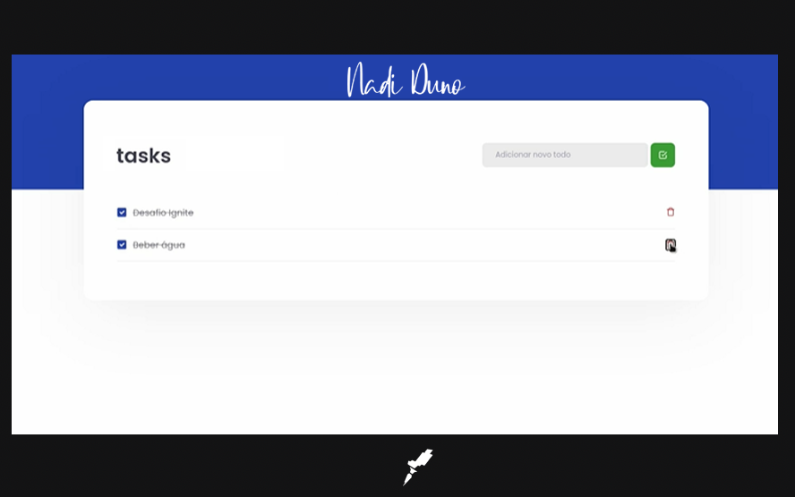

<h1 align="center">
  Challenge 01 - Task List 
   
  [Rocketseat](https://www.rocketseat.com.br/) © 2022
</h1>
 

  

## 🚀 Tecnologias

Esse projeto foi desenvolvido com as seguintes tecnologias:

- HTML e CSS
- JavaScript e JSON
- [Node e YARN](https://nodejs.org/)
- Teste

## 💻 Projeto

TaskList: Permite agregar tarefas a uma lista, depois as tarefas dessa lista podem ser verificadas como feitas ou podem ser eliminadas.

Primer desafio da trilha ReactJs na Rocketseat - 10/2022
